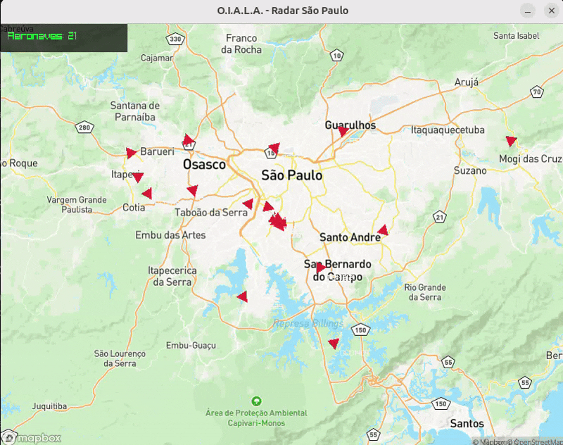

# O.I.A.L.A. – Observatório Integrado de Aeronaves e Logística Aérea

  

O **O.I.A.L.A.** é um sistema de monitorização de tráfego aéreo em tempo real, desenvolvido em C++ com foco em engenharia de sistemas de missão crítica. O projeto integra dados reais de satélites e recetores ADSB para visualizar aeronaves sobre a região metropolitana de São Paulo, utilizando técnicas de projeção cartográfica e computação gráfica de alta performance.

---

## 🛰️ O Que o Projeto Faz

O sistema transforma dados brutos de APIs globais numa interface visual intuitiva (Radar), permitindo:

* **Rastreio em Tempo Real:** Visualização da posição exata de aeronaves comerciais e privadas.
* **Telemetria de Voo:** Exibição do *Callsign* (identificação do voo), rumo (*Heading*) e altitude.
* **Consciência Situacional:** Mapeamento georreferenciado sobre uma base cartográfica de alta precisão (Mapbox).
* **Monitorização de Zona Crítica:** Foco dedicado aos eixos de aproximação dos aeroportos de Congonhas (SBSP), Guarulhos (SBGR) e Campo de Marte (SBMT).

---

## 🛠️ Como Ele Funciona

A arquitetura do projeto foi desenhada seguindo princípios de **Engenharia de Software** para garantir que o sistema seja fluido e preciso:

### 1. Aquisição de Dados (Backend)
O motor do projeto utiliza a biblioteca **libcurl** para realizar requisições autenticadas à rede **OpenSky Network**. Ele filtra o tráfego global através de um *Bounding Box* específico (coordenadas de latitude e longitude), garantindo que apenas os dados relevantes para a região de São Paulo sejam processados, economizando largura de banda e memória.

### 2. Processamento e Parse (JSON)
Os dados retornados pela API em formato JSON são processados pela biblioteca **cJSON**. O sistema extrai vetores de estado das aeronaves, convertendo strings e arrays brutos em estruturas de dados nativas do C++ (`structs`), prontas para a manipulação matemática.

### 3. Matemática de Projeção (Mercator)
Como a Terra é esférica e o ecrã é plano, o O.I.A.L.A. utiliza cálculos de **Projeção de Mercator** para converter coordenadas geográficas (Latitude/Longitude) em coordenadas de ecrã (Pixels X/Y). Isso garante que o avião apareça exatamente sobre a rua ou aeroporto correto na imagem de fundo, sem distorções lineares.

### 4. Renderização Gráfica (Raylib)
A interface é construída sobre a **Raylib**, utilizando aceleração por hardware (OpenGL).
* **Desenho Vetorial:** O ícone do avião é renderizado como um polígono rotacionado dinamicamente com base no *Heading* real da aeronave.
* **Ciclo de Atualização Não-Bloqueante:** O sistema utiliza timers baseados no tempo de sistema (`GetTime`) para atualizar os dados da API a cada 10 segundos, enquanto a interface mantém uma taxa de atualização de 60 quadros por segundo (FPS) para uma navegação fluida.

---

## 📐 Especificações Técnicas

* **Linguagem:** C++11/17.
* **Área de Cobertura:** * Latitude: [-24.00, -23.30]
    * Longitude: [-47.00, -46.30]
* **Resolução de Ecrã:** 1250x800 pixels.
* **Padrão de Codificação:** Inspirado em normas de segurança para sistemas críticos (MISRA).
* **Principais Bibliotecas:** Raylib, Libcurl e cJSON.

---

> **Nota:** Este projeto é uma ferramenta de estudo em sistemas de informação geográfica (GIS) e integração de APIs em tempo real.